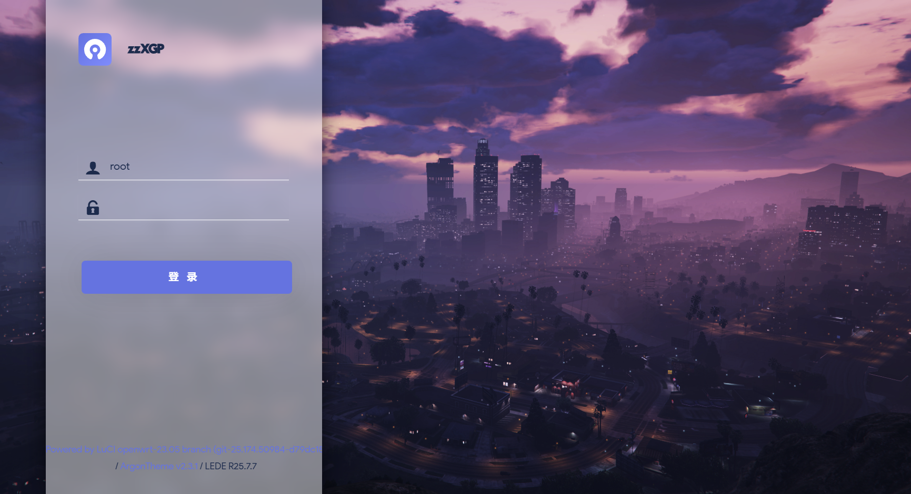
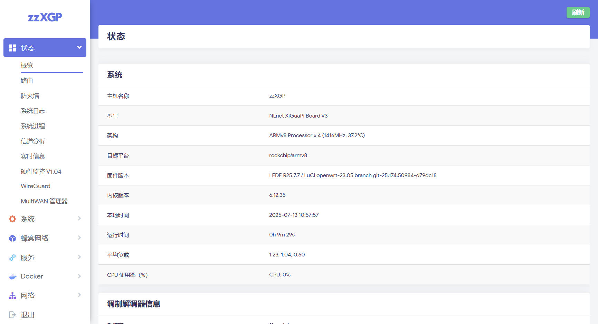

# NLnet XiGuaPi V3 (西瓜皮V3) LEDE 自动构建

内嵌常用软件包

## 说明

1. 第一次使用建议通过 RKDevTool 刷入，若通过 Web 刷入时提示不兼容请做好 USB 救砖准备再尝试
2. [Actions](https://github.com/zzzz0317/lede-xgp-auto-build/blob/main/.github/workflows/build.yml) 在北京时间每周五凌晨2点自动拉取 [LEDE](https://github.com/coolsnowwolf/lede) 代码编译并发布，平时可能会不定期手动触发更新
3. 默认 Wi-Fi SSID: `zzXGP`，密码: `xgpxgpxgp`
4. 默认 LAN 接口地址: `10.0.0.1`
5. 默认 root 密码: `password`，后续可能会变更

## 截图

## TODO

* [ ] 在线更新检查
* [ ] LEDE 代码更新检查

## ⚠️ 免责声明

1. **项目性质说明**  
   本项目在 GitHub Actions 自动编译过程中：
   - 实时拉取 [LEDE](https://github.com/coolsnowwolf/lede) 源码，和其它组件源码
   - 仅添加本仓库中的**公开可审查内容**

2. **设备风险自担**  
   - 任何因使用本项目固件导致的设备故障/变砖/安全问题
   - 任何因配置不当产生的网络风险或数据损失
   - 任何因第三方源码更新引发的兼容性问题
   **均与项目作者无关**，使用者需自行承担全部风险。

3. **使用限制条款**  

   ✅ **允许**：
   - 个人非商业用途
   - **免费、免授权**用于销售设备（预装固件）
   - **免费、免授权**用于技术服务（如刷机）

   ❌ **禁止**：
   - 将本仓库发布的固件文件作为付费商品单独销售

   ⚠️ **关键要求**：  
   当设备购买者/服务对象遇到：
   - 硬件故障
   - 网络配置问题
   - 非本项目导致的软件异常

   卖方/服务方必须自行提供技术支持，严禁将用户引导至本项目寻求帮助

4. 使用本项目即代表您**已充分理解并接受**：

    - 作者不对固件功能作任何明示/暗示担保
    - 任何商业使用产生的责任与作者无关
    - 违反使用条款造成的法律纠纷需自行承担

## 恰饭

[来个一键三连加关注呗](https://www.bilibili.com/video/BV1dU31ziEQf/)